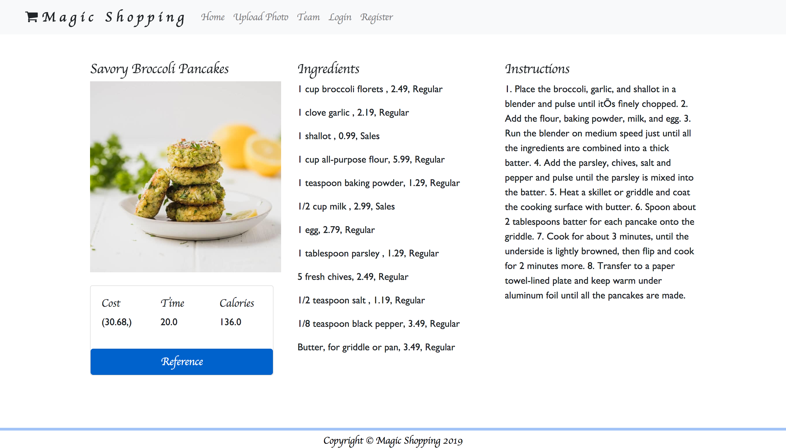

# Shopping App Project
Utilizig two machine learning models to create a full-functioning shopping recommendation web application for in-store customers.

## Background:
Our team wants to make grocery shopping more convenient. Sometimes we go to grocery to purchase food to cook lunch or dinner, but we don’t know what to purchase or what types of food to cook. Even we have an idea what to cook, it will end up missing purchase certain types of ingredient or not purchase enough amounts of it, then we couldn’t completed the cuisines. 

The idea of this app allows for people to upload images of their desired food and check different recipes with comprehensive ingredients, instruction, cook time and calories by using taking a picture of an ingredient at the store. According to the register information, the app can predict the risk of obesity the customer, in order to recommend her/him a ranking of recipes by low calories to high calories. 

For each recipe, we also show each ingredient’s cost at amazon. People can compare costs from regular grocery with amazon.  

## How to use the app:
* Register/login
* Upload the food Images 
* View recipes
* Select the desired recipe to check what ingredients need and how to cook in detail

## Technologies:
*  Loaded data to database
*  Created flask 
*  Used Xception model and VGG19 model to predict   images
*  Built web pages HTML5
*  Used Javascript to upload and diplay images

### Home Page:

### Upload Food Image to Predict Page: 

### Recommend Recipes:

### Check A Desired Recipe:

### Fill Out Register Form to Predict Risk of Obesity

### Prediction Result of Risk of Obesity and BMI

Copyright © 2020 Norman Lo
